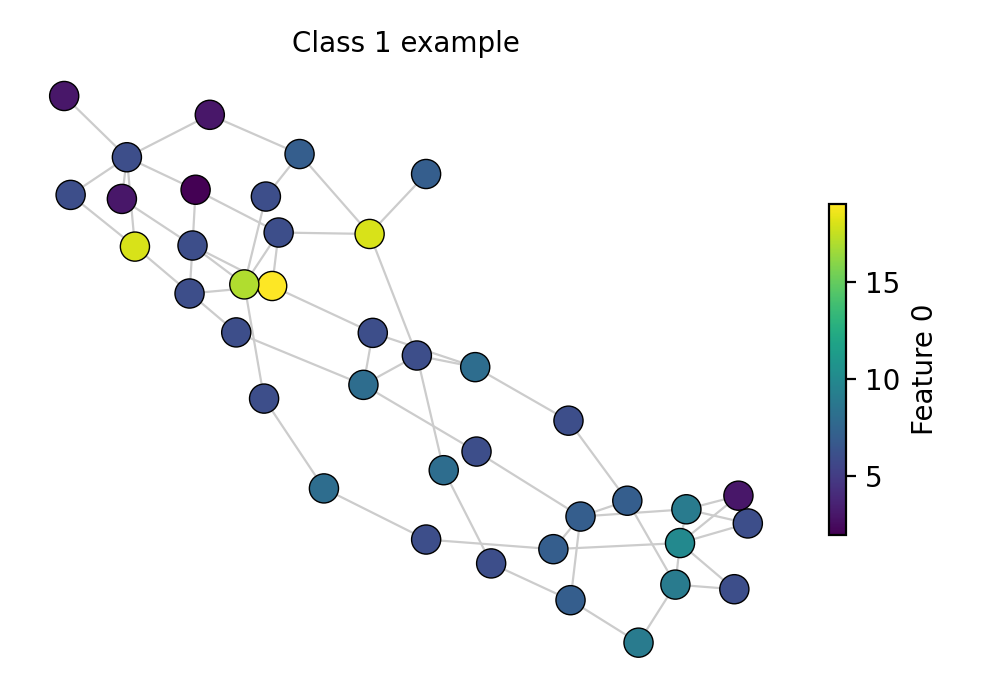
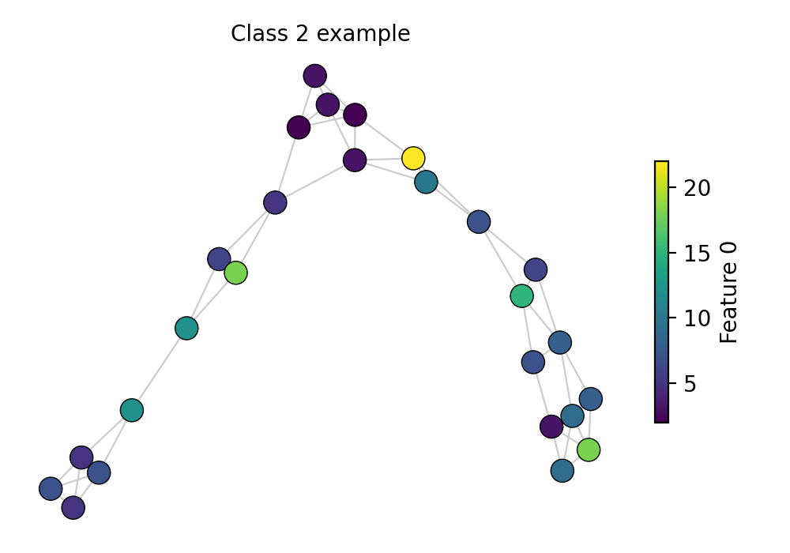
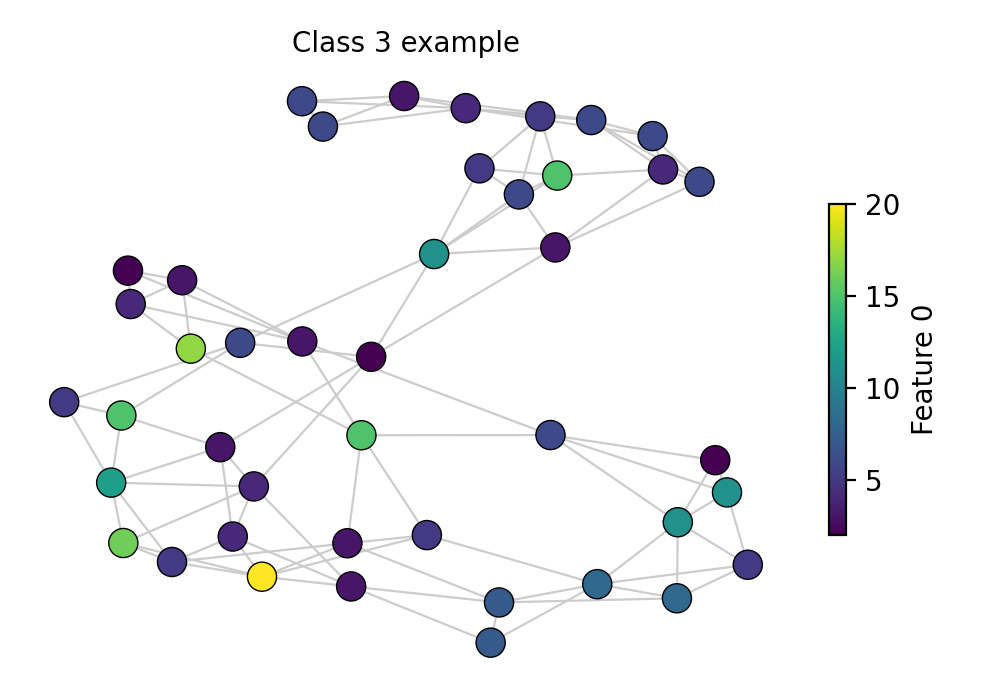
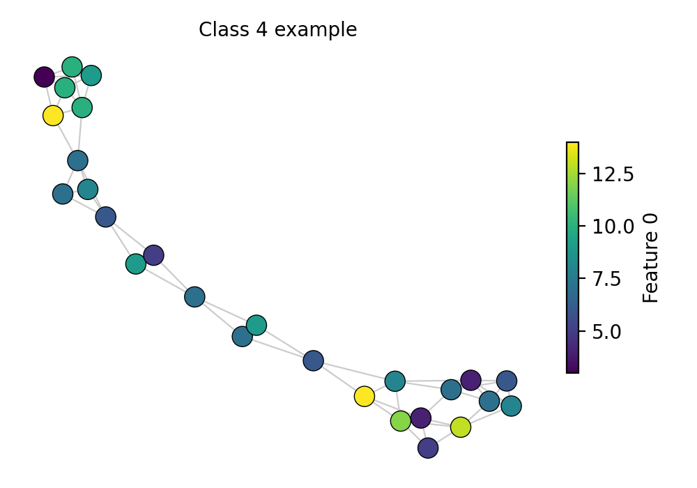
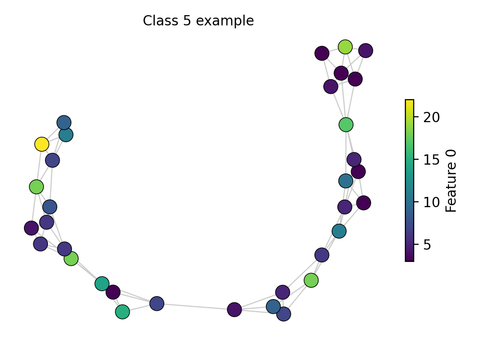
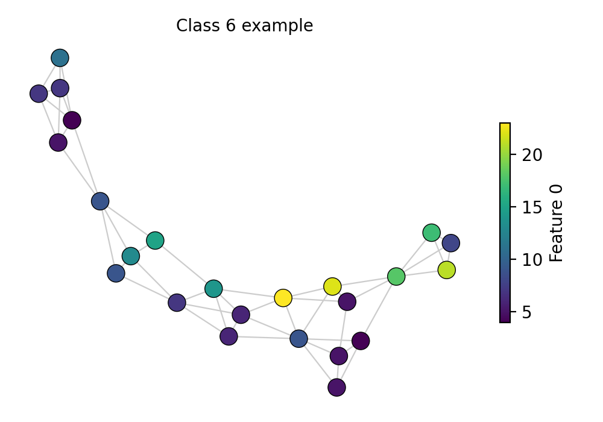

# 🧬 ENZYMES-Hard: Few-Shot Protein Function Classification

<p align="center">
  
  
  
  
</p>

<p align="center">
  <b>An Educational GNN Challenge for Robust Protein Function Prediction</b>
</p>

---

## ✨ What's New
- Web app lands on the leaderboard by default; navbar brand also points there.
- Submit page now guides you to open a Pull Request (no file uploads in the UI).
- Static web build exports via `next export` and deploys to GitHub Pages through Actions.
- Added ready-to-use GAT/GCN/GraphSAGE submission scripts under `submissions/`.
- GitHub Actions: PR validation via `evaluate.yml` and `update-leaderboard.yml` dispatcher to publish scores.
- GitHub Actions: PR validation via `evaluate.yml` and a `update-leaderboard.yml` dispatcher to publish scores to the site.

## 📋 Challenge Overview

Welcome to **ENZYMES-Hard**, a challenging Graph Neural Network competition designed to push your GNN skills to the limit! Your goal is to classify protein structures into their enzyme functional classes under realistic, difficult conditions.

### 🩺 Why this matters (biomed/health)
- Enzyme function prediction supports drug discovery by highlighting targets and off-target risks.
- Better generalization under missing data mirrors real-world biomolecular assays and noisy lab pipelines.
- Robust GNNs on protein graphs can accelerate annotation of novel enzymes in metagenomics and synthetic biology.

### 🎯 The Task

Classify protein tertiary structures (represented as graphs) into one of **6 EC top-level enzyme classes**:

| Class | Description |
|-------|-------------|
| 1 | Oxidoreductases |
| 2 | Transferases |
| 3 | Hydrolases |
| 4 | Lyases |
| 5 | Isomerases |
| 6 | Ligases |

### 🔥 What Makes This Hard?

This isn't your typical ENZYMES benchmark. We've added several real-world challenges:

| Challenge | Description |
|-----------|-------------|
| 📉 **Limited Training Data** | Only 240 training graphs (40 per class) - learn from less! |
| ⚖️ **Imbalanced Validation** | Validation set has imbalanced classes (45-40-35-25-20-15) |
| ❓ **Missing Features** | 10-15% of node features are missing (NaN values) |
| 🔗 **Edge Dropout** | 10% of edges hidden in test graphs |
| 🏋️ **Model Constraints** | Maximum 100K parameters, train in <5 min on CPU |

---

## 📊 Dataset Statistics

| Split | Graphs | Class Distribution | Notes |
|-------|--------|-------------------|-------|
| Train | 240 | Balanced (40/class) | Complete features |
| Validation | 180 | Imbalanced (45-40-35-25-20-15) | Missing features |
| Test | 180 | Imbalanced (15-20-25-35-40-45) | Missing features + Edge dropout |

### 👀 Sample Graph Visualizations (One per Class)

| Class 1 | Class 2 | Class 3 |
|---------|---------|---------|
|  |  |  |

| Class 4 | Class 5 | Class 6 |
|---------|---------|---------|
|  |  |  |

- Nodes: colored by feature 0; titles show the enzyme class label.
- Edges: undirected spring layout for readability.
- Extracted from `data/challenge/train.pt`; each panel is one real graph example.

### Graph Properties
- **Nodes per graph**: 2-126 (avg: ~32)
- **Node features**: 18 continuous attributes (chemical/structural properties)
- **Node labels**: 3 categorical labels (amino acid types)
- **Edges**: Represent spatial proximity between amino acids

### 🌐 Web App Quick Notes
- Landing page redirects to the leaderboard; nav links: Leaderboard, Docs, Submit.
- Submit tab summarizes the PR-based submission flow (see "How to Submit").
- Production build: `npm run build` (outputs static files to `out/`).
- GitHub Pages: https://khadidja2005.github.io/GNN_challenge/

---

## 🚀 Getting Started

### Option 1: Using Docker (Recommended)

#### Prerequisites
- [Docker](https://docs.docker.com/get-docker/)
- [Docker Compose](https://docs.docker.com/compose/install/)

#### Quick Start

```bash
# Clone the repository
git clone https://github.com/khadidja2005/GNN_challenge.git
cd GNN_challenge

# Start all services (Web UI + Python environment)
docker-compose up --build

# Access the Web UI at http://localhost:3000
```

#### Run GNN Scripts with Docker

```bash
# Prepare challenge data
docker-compose run gnn python scripts/prepare_data.py

# Train the baseline model
docker-compose run gnn python baselines/simple_gnn.py

# Evaluate your predictions
docker-compose run gnn python scripts/evaluate.py --predictions submissions/predictions.csv

# Interactive Python shell
docker-compose run gnn bash
```

#### Development Mode (with hot reload)

```bash
docker-compose --profile dev up web-dev
# Access at http://localhost:3001
```

### Option 2: Local Installation

#### 1. Clone the Repository

```bash
git clone https://github.com/khadidja2005/GNN_challenge.git
cd GNN_challenge
```

#### 2. Install Dependencies

```bash
pip install -r requirements.txt
```

#### 3. Prepare the Challenge Data

```bash
python scripts/prepare_data.py
```

#### 4. Explore the Starter Notebook

```bash
jupyter notebook notebooks/getting_started.ipynb
```

#### 5. Run the Baseline

```bash
python baselines/simple_gnn.py
```

#### 6. Run the Web UI (Optional)

```bash
cd web
npm install
npm run dev
# Access at http://localhost:3000

# Production build (static export)
npm run build
npm run export
```

---

## 📁 Repository Structure

```
GNN_challenge/
├── README.md                    # This file
├── RULES.md                     # Detailed challenge rules
├── DOCKER.md                    # Docker deployment guide
├── requirements.txt             # Python dependencies
├── docker-compose.yml           # Docker orchestration
├── Dockerfile.python            # Python GNN environment
├── Dataset/
│   └── ENZYMES/                 # Original TUDataset files
├── data/
│   └── challenge/               # Processed challenge splits (after running prepare_data.py)
│       ├── train.pt             # Training graphs
│       ├── val.pt               # Validation graphs
│       ├── test.pt              # Test graphs (labels hidden)
│       └── metadata.json        # Dataset metadata
├── scripts/
│   ├── prepare_data.py          # Data preparation with difficulty modifications
│   └── evaluate.py              # Evaluation script
├── baselines/
│   └── simple_gnn.py            # Baseline GNN model (<100K params)
├── notebooks/
│   └── getting_started.ipynb    # Starter notebook
├── submissions/
│   ├── template.py              # Submission template
│   ├── example_submission.csv   # Example submission format
│   ├── gat_submission.py        # Example GAT solution
│   ├── gcn_submission.py        # Example GCN solution
│   ├── graphsage_submission.py  # Example GraphSAGE solution
│   └── */                       # Place your team folder + predictions here
├── web/                         # Next.js Web UI
│   ├── Dockerfile               # Production web build
│   ├── Dockerfile.dev           # Development build
│   └── src/                     # React components
└── .github/
    └── workflows/
        ├── evaluate.yml         # Automated evaluation
        └── deploy.yml           # Static web deploy to GitHub Pages
```

---

## 📝 Submission Format

Your submission should be a CSV file with the following format:

```csv
graph_id,prediction
0,3
1,1
2,5
...
```

- `graph_id`: Index of the test graph (0-179)
- `prediction`: Predicted class (1-6)

### How to Submit

1. Fork this repository
2. Create your solution in `submissions/your_name/` using `submissions/template.py` or the GAT/GCN/GraphSAGE examples as a starting point
3. Generate `predictions.csv` (match the format above) and include any helper code needed to reproduce it
4. Open a Pull Request — the Submit page in the web app links to these steps
5. (Optional) Add a short `model_info.json` describing hyperparameters and training notes

---

## 🏆 Evaluation

### Primary Metric: Macro F1-Score

$$\text{Macro F1} = \frac{1}{C} \sum_{c=1}^{C} F1_c$$

where $F1_c = \frac{2 \cdot P_c \cdot R_c}{P_c + R_c}$

This metric treats all classes equally, regardless of their frequency.

### Secondary Metric: Accuracy

$$\text{Accuracy} = \frac{\text{Correct Predictions}}{\text{Total Predictions}}$$

### Evaluate Your Predictions

```bash
# Using Docker (recommended)
docker-compose run gnn python scripts/evaluate.py --predictions submissions/your_predictions.csv

# Or locally
python scripts/evaluate.py --predictions submissions/your_predictions.csv
```

### 🔒 Hidden Test Labels

- Test labels are **not stored in the repo**. Run local checks with `--ground_truth val` only.
- CI can score the hidden test split when a maintainer sets one of these repository secrets:
  - `TEST_LABELS_B64`: Base64 of `data/challenge/.ground_truth/test_labels.json`
  - `TEST_LABELS_JSON`: Raw JSON string of the same file
- To create the Base64 secret locally: `base64 -w0 data/challenge/.ground_truth/test_labels.json`
- The evaluation workflow injects these secrets and never exposes the file to participants.

---

## 🎖️ Leaderboard

| Rank | Team | Macro F1 | Accuracy | Parameters | Training Time |
|------|------|----------|----------|------------|---------------|
| 🥇 | - | - | - | - | - |
| 🥇 | - | - | - | - | - |
| 🥈 | - | - | - | - | - |
| 🥉 | - | - | - | - | - |
| 📊 | Baseline | ~0.35 | ~0.38 | 45K | ~2 min |
---

## 📜 Rules Summary

1. **Parameter Limit**: Maximum 100,000 trainable parameters
2. **Training Time**: Must complete in <5 minutes on CPU (Intel i5 or equivalent)
3. **No External Data**: Only use the provided training data
4. **No Pre-trained Models**: Train from scratch
5. **Reproducibility**: Set random seed and provide complete code

See [RULES.md](RULES.md) for complete rules.

---

## 💡 Tips & Hints

<details>
<summary><b>Dealing with Missing Features</b></summary>

- Consider imputation strategies (mean, median, learned)
- Use masking to indicate missing values
- Graph-based imputation using neighbor information
</details>

<details>
<summary><b>Handling Limited Data</b></summary>

- Data augmentation (node dropout, feature noise)
- Regularization (dropout, weight decay)
- Simple architectures often work better with limited data
</details>

<details>
<summary><b>Class Imbalance</b></summary>

- Weighted loss functions
- Focal loss
- Oversampling minority classes
</details>

<details>
<summary><b>Efficient Architectures</b></summary>

- Reduce hidden dimensions
- Use graph-level pooling early
- Consider GIN, GraphSAGE, or GAT variants
</details>

---

## 📚 Resources

- [PyTorch Geometric Documentation](https://pytorch-geometric.readthedocs.io/)
- [TUDataset Paper](https://arxiv.org/abs/2007.08663)
- [ENZYMES Original Paper](https://academic.oup.com/bioinformatics/article/21/suppl_1/i47/202991)
- [GNN Survey](https://arxiv.org/abs/1901.00596)

---

## 📧 Contact

- **Challenge Organizer**: [@khadidja2005](https://github.com/khadidja2005)
- **Issues**: Open an issue for questions or bug reports

---

## 📄 License

This challenge uses the ENZYMES dataset from TUDataset. See [LICENSE](LICENSE) for details.

---

<p align="center">
  <b>Good luck! May your gradients flow smoothly! 🚀</b>
</p>
